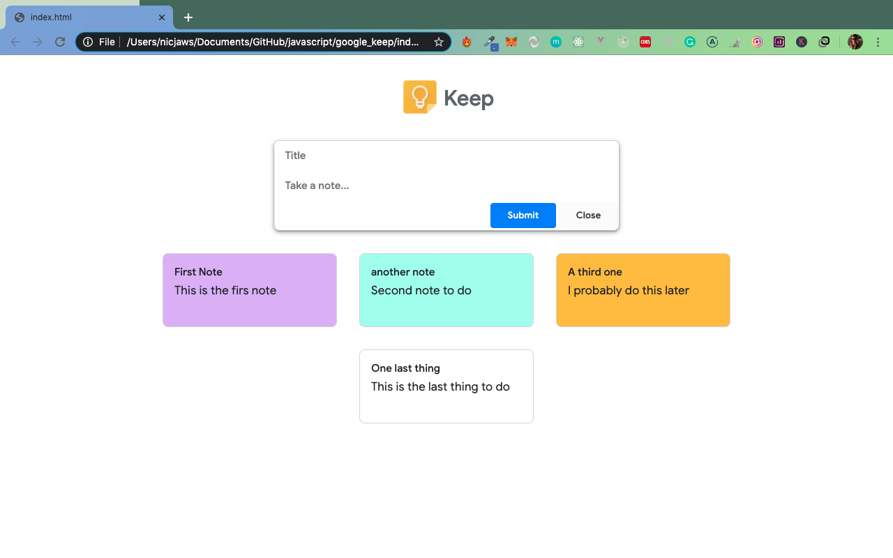

I created a Google Keep clone to save notes. I have done it with HTML, CSS and Javascript

You can change the color to the notes in order to give them level of priority.

You can as well make zoom in every note and edit them or delete.

The notes are saved in local storage, that means even you reset the browser or close it, the note will remain there next time you open.

